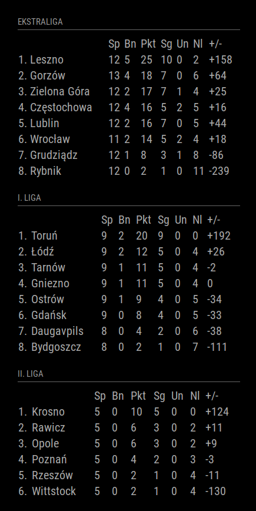

# MMM-Speedway
This is an extension for the [MagicMirror](https://github.com/MichMich/MagicMirror). It displays the tables of the Polish Speedway Leagues (Ekstraliga, I. Liga, II. Liga).

## Screenshot


## Installation
1. Navigate into your MagicMirror's `modules` folder and execute `git clone https://github.com/LukasKlose/MMM-Speedway.git`. A new folder will appear navigate into it.
2. Execute `npm install` to install the node dependencies.

## Using the module

To use this module, add it to the modules array in the `config/config.js` file. It is recommended to use the module in the position `top_left` or `top_right`.
````javascript
modules: [
    {
        module: 'MMM-Speedway',
        position: 'top_left',
        config: {
            // See 'Configuration options' for more information.
        }
    }
]
````

## Configuration options

The following properties can be configured:


<table width="100%">
	<!-- why, markdown... -->
	<thead>
		<tr>
			<th>Option</th>
			<th width="100%">Description</th>
		</tr>
	<thead>
	<tbody>
		<tr>
			<td><code>fetchInterval</code></td>
			<td>The time in miliseconds before new results are fetched.<br>
				<br><b>Possible values:</b> <code>int</code>
				<br><b>Default value:</b> <code>21600000</code> (6 hours)
			</td>
		</tr>
		<tr>
			<td><code>ekstraliga</code></td>
			<td>Determines, if the table for the <b>Ekstraliga</b> is shown.<br>
				<br><b>Possible values:</b> <code>Boolean</code>
				<br><b>Default value:</b> <code>true</code>
			</td>
		</tr>
        <tr>
			<td><code>pierwszaliga</code></td>
			<td>Determines, if the table for the <b>I. League</b> is shown.<br>
				<br><b>Possible values:</b> <code>Boolean</code>
				<br><b>Default value:</b> <code>true</code>
			</td>
		</tr>
        <tr>
			<td><code>drugaliga</code></td>
			<td>Determines, if the table for the <b>II. League</b> is shown.<br>
				<br><b>Possible values:</b> <code>Boolean</code>
				<br><b>Default value:</b> <code>true</code>
			</td>
		</tr>
	</tbody>
</table>

The MIT License (MIT)
=====================

Copyright © 2020 LukasKlose

Permission is hereby granted, free of charge, to any person
obtaining a copy of this software and associated documentation
files (the “Software”), to deal in the Software without
restriction, including without limitation the rights to use,
copy, modify, merge, publish, distribute, sublicense, and/or sell
copies of the Software, and to permit persons to whom the
Software is furnished to do so, subject to the following
conditions:

The above copyright notice and this permission notice shall be
included in all copies or substantial portions of the Software.

**The software is provided “as is”, without warranty of any kind, express or implied, including but not limited to the warranties of merchantability, fitness for a particular purpose and noninfringement. In no event shall the authors or copyright holders be liable for any claim, damages or other liability, whether in an action of contract, tort or otherwise, arising from, out of or in connection with the software or the use or other dealings in the software.**
